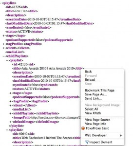
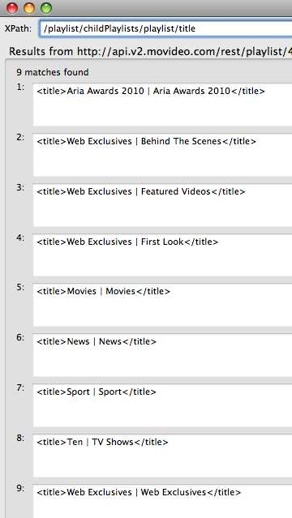

Within my <a title="HPTC setup" href="http://adamrumbold.com/?p=8" target="_self">HTPC setup</a> I&#8217;ve put in a few useful <a title="PlexPlugins" href="http://elan.plexapp.com/category/plug-ins/" target="_blank">plugins</a>.  Particularly the official <a title="ABCiView" href="http://wiki.plexapp.com/index.php/ABC_iView" target="_blank">ABC</a> and unofficial <a title="SBS" href="http://wiki.plexapp.com/index.php/SBS" target="_blank">SBS</a> plugin.  The Australian commercial channels are now on the scene with on-demand TV available to be streamed online.

Since no one else has yet &#8211; I set about taking the Channel 10 <a title="Ch10" href="http://ten.com.au/watch-tv-episodes-online.htm" target="_blank">website</a> with it&#8217;s flash video content and surfacing it in a Plex video plugin.  When I got stuck &#8211; someone on the forums indicated that they&#8217;d setup the menu system for a <a title="NineMsn" href="http://fixplay.ninemsn.com.au/" target="_blank">Channel 9</a> but were outside of Oz so couldn&#8217;t stream the video content.   From novice (new to Python and Plex plugin development) to having 2 functioning, useful, plugins was pretty easy.  Hopefully this will help others who want to give it a try.

  

    
    
    

      9 MSN and SC 10 plugins
    

  

  
  <h3>
    <!--more-->
  </h3>
  
  <h3>
    Tools Required
  </h3>
  
  <ul>
    <li>
      Firefox + plugins
    </li>
  </ul>
  
  <ul>
    <li>
      <ul>
        <li>
          <a title="HttpFox" href="https://addons.mozilla.org/en-US/firefox/addon/6647/" target="_blank">HttpFox</a> &#8211; to sniff traffic as you browse a site
        </li>
        <li>
          <a title="FireBug" href="https://addons.mozilla.org/en-US/firefox/addon/1843/" target="_blank">Firebug</a> &#8211; to inspect elements in a web page
        </li>
        <li>
          <a title="XPathChecker" href="https://addons.mozilla.org/en-US/firefox/addon/1095/" target="_blank">XPath Checker</a> &#8211; to interactively run XPath queries against a URL (html/xml)
        </li>
      </ul>
    </li>
  </ul>
  
  <ul>
    <li>
      Python IDE (<a title="Komodo" href="www.activestate.com/komodo-edit" target="_blank">Komodo</a> worked well)
    </li>
    <li>
      Silverlight browser plugins (to play silverlight media)
    </li>
    <li>
      Flash v10.0 (NB. v10.1 has an issue causing only audio to play &#8211; downgrade if necessary)
    </li>
  </ul>
  
  

    Of course &#8211; Plex9 is also essential.
  

  
  <h3>
    The Basics
  </h3>
  
  

    Before you start &#8211; you should check nobody else is already developing your plugin, and let others know you are starting a new plugin.  Add an entry to the <a title="PluginsProgress" href="http://wiki.plexapp.com/index.php/Plugins_in_progress" target="_blank">plugins in progress</a> page.
  

  
  

    Plex Plugins are installed either from within Plex (app store) or can simply be copied into:
  

  
  

    <code>~/Library/Application\ Support/Plex\ Media\ Server/Plug-ins</code>
  

  
  

    Take a like plugin (ie. a video plugin) and copy to a working directory.  The structure is shown below.
  

  
  <ul>
    <li>
      Main code for a plugin is in __init__.py
    </li>
    <li>
      Site Configuration is only required when playing inline media in a webpage
    </li>
    <li>
      Resources hold background images and the plugin icon
    </li>
  </ul>
  
  

    If you need to peek inside the bundle &#8211; either right click in Finder and select &#8216;Show Package Contents&#8217; ,  or change the plugins name to remove the .bundle and turn it into a standard folder (accept the friendly OS X warning).
  

  
  

    In general terms &#8211; the Plex architecture makes it straight forward to setup a nice plugin.  In the __init__.py you will need to
  

  
  <ol>
    <li>
      Setup the menu structure and populate menu items based metadata you can scrape from the website (eg. categories, most popular, recently added)
    </li>
    <li>
      Scrape information from the website to populate the title, thumbnails, summary for a series/episode.
    </li>
    <li>
      Ensure you have a valid URL so the requested media will play when selected.
    </li>
  </ol>
  
  

    Sounds simple &#8211; but it did take a number of iterations and a few scratches of the head to work through.
  

  
  <h3>
    How to Go About it
  </h3>
  
  

    Any new plugins copied into the plug-ins directory are automatically picked up and deployed by the Plex Media Server.  You can view the logs to see what is going on
  

  
  

    <code>~/Library/Logs/Plex.log</code>   <code>&lt;span style="color: #000080;">~/Library/Logs/Plex\ Media\ Server.log&lt;/span>&lt;br />
</code>
  

  
  

    But it is much simpler to run Plex Media Server in debug mode from within Terminal:
  

  
  

    <code>Thumper:~ Adam$  /Users/Adam/Library/Application\ Support/Plex/Plex\ Media\ Server.app/Contents/MacOS/Plex\ Media\ Server woof&lt;br />
Enabled debugging mode.&lt;br />
2010-10-03 11:54:53.289 Plex Media Server[8594:3837] Initializing Cocoa updater</code>
  

  
  

    As you develop you will want to include calls to the Plex Log function to assist in debugging, these messages will be written to both the console and Plex Media Server logs.
  

  
  

    <code>Log("Adding seriesID = " + seriesInfo['id'])</code>
  

  
  

    I&#8217;d recommend focusing initially on getting your menu structure and items working.  This can be done by using XPath queries against the source from the website page(s).  In the case of the SC10 plugin, by sniffing traffic I found the TV shows online were both displayed in elements in the HTML page, but also catalogued in XML files.  Learning as I went I used the XML files, which could also be easily parsed using XPath queries.  The downside to this is the web page(s) have some extra images that would have been useful for thumbnails.  I&#8217;ll revisit this for v0.2.
  

  
  <dl id="attachment_176" class="wp-caption alignleft" style="width: 174px;">
    <dt>
      
    </dt>
  </dl>
  
  

    Once you&#8217;ve got the appropriate URL (with categories, or all shows listed) point FireFox there and right click (on the element of interest) and select &#8216;ViewXPath&#8217;
  

  
  <dl id="attachment_178" class="wp-caption alignright" style="width: 80px;">
    <dt>
      
    </dt>
  </dl>
  
  

    The XPath Checker utility then lets you interactively query the page until you get valid entries for your menu.  Pulling this together in Python is then pretty straight forward:
  

  
  

    <code> xml = XML.ElementFromURL(URL)</code>
  

  
  

    <code>categories = {}&lt;br />
for category in xml.xpath('XPATHEXPRESSION'):&lt;br />
</code>
  

  
  

    <code> id = category.find('id').text&lt;br />
name = category.find('title').text&lt;br />
categories[id] = name&lt;br />
return categories</code>
  

  
  

    From these categories we can setup the Main Video Menu &#8211; ie. Top level menu
  

  
  

    <code>def VideoMainMenu():&lt;br />
dir = MediaContainer(viewGroup="InfoList")&lt;br />
for name, id in categories:&lt;br />
dir.Append(Function(DirectoryItem(CategoryMenu, name), category=id))&lt;br />
return dir</code>
  

  
  

    Note we&#8217;ve added to this Main Menu &#8211; the DirectoryItem <strong>CategoryMenu</strong> this function will be called upon selecting one of our items in the Main Menu.  This means you can construct your own menu structure, and handle various menu selections differently if required.  At some point you&#8217;ll have traversed your menu structure down to a video item you want to play  &#8211; at this point in your Python code you&#8217;ll be adding a <em>Media Item</em> rather than a <em>DirectoryItem</em>.
  

  
  

    Plex has a number of media items &#8211; the one you use will depend on the type of media you are playing
  

  
  <ul>
    <li>
      WebVideoItem  Use this when you are playing a flash/silverlight video embedded within a webpage.
    </li>
    <li>
      VideoItem  Use this item if you have an mpeg or flv file you want to play directly
    </li>
    <li>
      RTMPVideoItem  Use this if you have streaming media to play
    </li>
    <li>
      WindowsMediaVideoItem  Stream windows media  
    </li>
  </ul>
  
  

    In my case &#8211; SC10 used flash video and Channel9 used silverlight.  I couldn&#8217;t get a direct URL to a media file &#8211; so had to play the content inline within the web page.
  

  
  

    <code>dir.Append(WebVideoItem(episode['playerUrl'], title=episode['title'], subtitle="",&lt;br />
summary=description, thumb=episode['thumb'], duration=""))</code>
  

  
  

    Because this was embedded content &#8211; the plugin needs a Site Configuration file for it to understand the dimensions of the content, where the seekbar is (so you can pause/fast forward/view progress), etc.  This took me a while to get right &#8211; but in the end it was simple:  
  

  
  

    <code>&lt;site site="http://ten.com.au/.*"&lt;br />
plugin="http://apps.v2.movideo.com/player/flash/movideo_player.swf"&lt;br />
initialState="playing"&lt;br />
version="1.0"&gt;</code>
  

  
  

    <code>&lt;crop x="0" y="0" width="512" height="288" /&gt;</code>
  

  
  

    Look at the reference document for <a title="SiteConfig" href="http://wiki.plexapp.com/index.php/Creating_Plugins_Site_Config" target="_blank">creating a site config</a>.  The downside to both Ch9 and SC10 is they hide the seek bar &#8211; so it is not possible to fast forward, pause or track progress through a show. 
  

  
  

    .. and viola two new (currently unsupported) plugins developed and published.  Downloadable here&#8211;> <a title="NineMSN_Plugin" href="http://wiki.plexapp.com/index.php/NineMSN" target="_blank">Ch9</a> and here &#8211;><a title="SC10_plugin" href="http://wiki.plexapp.com/index.php/Channel10" target="_blank">SC10</a>
  

  
  

    
  

  
  

    
    
    

      SC 10 plugin - loading streaming content
    

  

  
  

    
    
    

      SC10 playing content
    

  

  
  <h3>
    References
  </h3>
  
  <ul>
    <li>
      <a title="PlexDev" href="http://dev.plexapp.com/docs/index.html" target="_blank">Plex development manual</a>
    </li>
    <li>
      <a title="PlexForums" href="http://forums.plexapp.com/index.php?showforum=42" target="_blank">Plex forums</a>
    </li>
    <li>
      <a title="Scraping" href="http://wiki.plexapp.com/index.php/Scraping_helper_tools" target="_blank">Scraping tools</a>
    </li>
    <li>
      <a title="ThingsInAJar" href="http://blah.thingsinjars.com/post/297/writing-a-plex-plugin-part-i/" target="_blank">Blog</a> from thingsinajar on transmission plugin development
    </li>
  </ul>